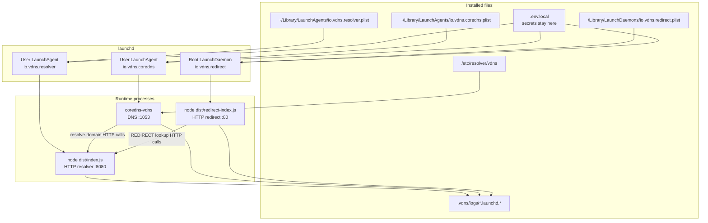

# macOS launchd services

The launchd service installer is an alpha packaging layer for the local vDNS stack. It uses the same built resolver, CoreDNS binary, redirect service, `.env.local`, and `/etc/resolver/vdns` split-DNS file as the dev scripts.

Do not install service mode from `~/Desktop`, `~/Documents`, `~/Downloads`, or iCloud Drive. macOS privacy controls can block background launchd jobs from reading those folders, which appears as launchd exit code `126` and `Operation not permitted` in `.vdns/logs/*.launchd.err`. Put the checkout somewhere like `~/Developer/vdns`.

## Dev mode vs service mode

Dev mode:

```sh
pnpm vdns:up
pnpm vdns:status
pnpm vdns:demo
pnpm vdns:down
```

`vdns:up` starts background processes from the current shell and records PIDs under `.vdns/pids`. `vdns:down` stops only matching vDNS processes.

Service mode:

```sh
pnpm build
cp .env.vdns.local.example .env.local
# edit .env.local
pnpm vdns:install
pnpm vdns:start
pnpm vdns:service-status
pnpm vdns:demo
pnpm vdns:stop
pnpm vdns:uninstall
```

`vdns:install` writes launchd plist files and installs `/etc/resolver/vdns` when needed. `vdns:start` bootstraps and kickstarts the jobs. `vdns:stop` bootouts the jobs but leaves plist files installed. `vdns:uninstall` stops jobs and removes plist files.


## Service architecture



The resolver and CoreDNS jobs run in the logged-in user's launchd GUI domain. The redirect job runs in the system domain because binding port `80` requires root privileges. The plist files contain paths and safe environment values only; RPC credentials remain in `.env.local` and are loaded by the wrapper scripts at runtime.

## Installed files

User LaunchAgents:

```text
~/Library/LaunchAgents/io.vdns.resolver.plist
~/Library/LaunchAgents/io.vdns.coredns.plist
```

Root LaunchDaemon:

```text
/Library/LaunchDaemons/io.vdns.redirect.plist
```

The plist files call wrapper scripts in this checkout:

```text
scripts/macos/run-resolver-service.sh
scripts/macos/run-coredns-service.sh
scripts/macos/run-redirect-service.sh
```

The plists do not embed RPC secrets. The wrappers load `.env.local` at runtime.

## Split DNS

The installer verifies `/etc/resolver/vdns` and runs the existing resolver installer when the file is missing or has the wrong local DNS port.

By default, uninstall leaves `/etc/resolver/vdns` installed:

```sh
pnpm vdns:uninstall
```

Remove it explicitly:

```sh
pnpm vdns:uninstall -- --remove-resolver
```

## Logs

launchd writes service output under:

```text
.vdns/logs/resolver.launchd.log
.vdns/logs/resolver.launchd.err
.vdns/logs/coredns.launchd.log
.vdns/logs/coredns.launchd.err
.vdns/logs/redirect.launchd.log
.vdns/logs/redirect.launchd.err
```

## Troubleshooting

Check service state:

```sh
pnpm vdns:service-status
launchctl print gui/$(id -u)/io.vdns.resolver
launchctl print gui/$(id -u)/io.vdns.coredns
sudo launchctl print system/io.vdns.redirect
```

Check listeners:

```sh
lsof -nP -iTCP:8080 -sTCP:LISTEN
lsof -nP -iTCP:1053 -sTCP:LISTEN
lsof -nP -iUDP:1053
sudo lsof -nP -iTCP:80 -sTCP:LISTEN
```

Check split DNS:

```sh
cat /etc/resolver/vdns
scutil --dns
dscacheutil -q host -a name google.vdns
```

Run the demo checks:

```sh
pnpm vdns:demo
curl -i --max-time 10 http://chainvue.vdns
```

The redirect service is installed as a root LaunchDaemon because port `80` is privileged. This is what lets browser-style URLs such as `http://chainvue.vdns` work without an explicit port.

## Dry run

Preview generated plist files without writing LaunchAgents, LaunchDaemons, or `/etc/resolver`:

```sh
pnpm vdns:install -- --dry-run
```

## Purge

Remove launchd plists and delete local logs/PID files while preserving `.env.local`:

```sh
pnpm vdns:uninstall -- --purge
```

Combine purge with resolver removal:

```sh
pnpm vdns:uninstall -- --remove-resolver --purge
```

## Alpha limitations

- macOS only.
- Requires a built `dist/index.js`, built `dist/redirect-index.js`, executable `coredns/coredns-vdns`, and `.env.local`.
- Uses the current checkout path in launchd plist files. Reinstall services if the repository moves.
- The checkout must be outside macOS privacy-protected user folders such as Desktop, Documents, Downloads, and iCloud Drive unless you explicitly grant suitable system privacy permissions.
- Node must be available at install time or in a common Homebrew path.
- HTTPS, local TLS certificates, and a local CA are future work.
